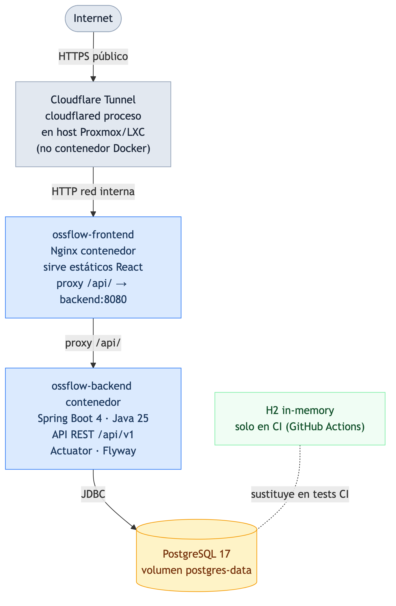
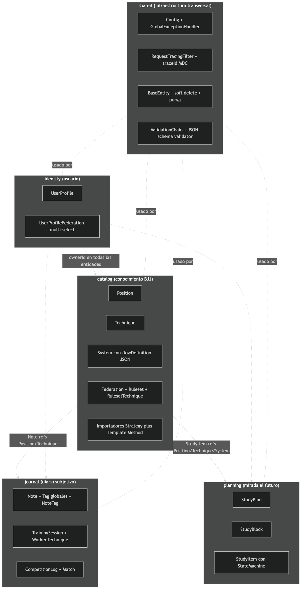
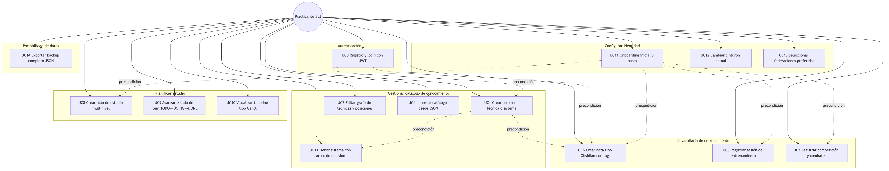
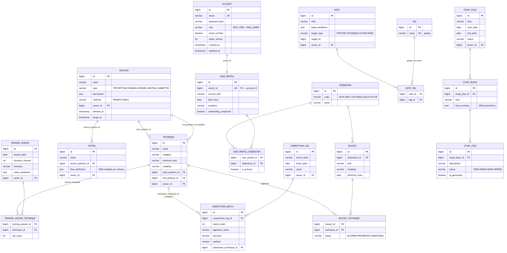
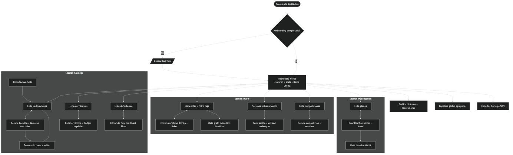
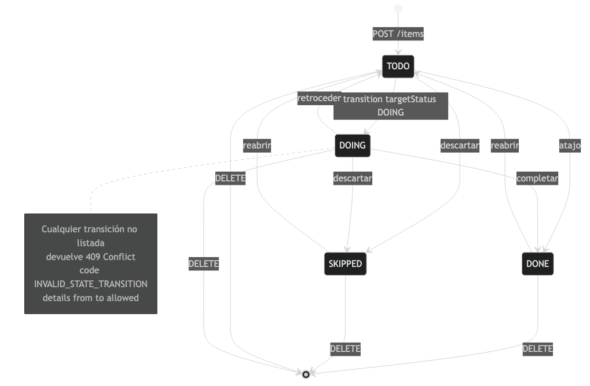
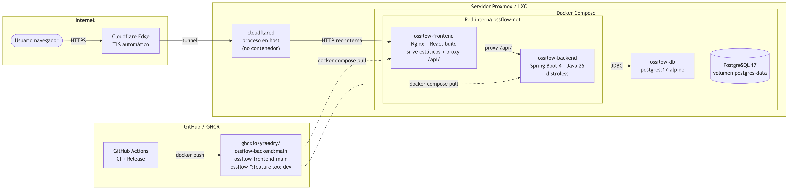
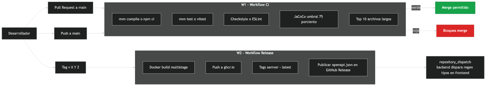

\newpage

# Portada {-}

::: {.center}

{width=40%}

\vspace{2cm}

\Huge **OssFlow**

\Large *Segundo cerebro para Brazilian Jiu-Jitsu*

\vspace{3cm}

\large

| Campo | Valor |
| ----- | ----- |
| **Curso / Modalidad** | Desarrollo de Aplicaciones Multiplataforma (DAM) |
| **Alumno** | Adrian Nuñez Sanchez |
| **Tutor del TFG** | *[Por asignar]* |
| **Fecha** | Mayo de 2026 |

:::

\newpage

# Dedicatoria {-}

A todos los compañeros de tatami que han aportado, sin saberlo, el conocimiento técnico que da forma a este proyecto. Y al Brazilian Jiu-Jitsu, por enseñar que el progreso real es estructurado, paciente y, sobre todo, basado en la documentación honesta de cada error.

\newpage

# Índices {-}

*Índice de contenido, índice de tablas e índice de ilustraciones generados automáticamente por Word a partir de los estilos del documento.*

\newpage

# Abstract {-}

## Español

OssFlow es una aplicación web concebida como **segundo cerebro técnico** para practicantes de Brazilian Jiu-Jitsu. El sistema modela el conocimiento del deporte como un **grafo relacional** de posiciones (nodos) y técnicas (transiciones), permitiendo además construir **sistemas** que representan árboles de decisión técnico-tácticos completos. Sobre ese catálogo objetivo, el usuario superpone su capa subjetiva: notas tipo Obsidian, un registro detallado de sesiones de entrenamiento, log de competiciones combate a combate, y un plan de estudio jerárquico a meses vista. Una capa de identidad asocia al usuario su cinturón actual y federaciones preferidas (IBJJF, ADCC, AJP, NAGA, UAEJJF, FEJJB, AEJJ, SBJJ, CBJJE, GI), y muestra avisos no bloqueantes sobre la legalidad de las técnicas según la federación y cinturón.

El backend está construido con Spring Boot 4 y Java 25, sigue una arquitectura **hexagonal-lite** con seis bounded contexts, persiste en **PostgreSQL 17** (con H2 in-memory para tests de CI) y expone una API REST documentada con OpenAPI. El frontend es una SPA en React 19 + Vite + TypeScript con shadcn/ui. El despliegue se realiza sobre Docker Compose en un contenedor LXC en servidor doméstico, con CI/CD automatizado en GitHub Actions.

## English

OssFlow is a web application conceived as a **technical second brain** for Brazilian Jiu-Jitsu practitioners. The system models the sport's knowledge as a **relational graph** of positions (nodes) and techniques (transitions), and additionally enables building **systems** that represent complete tactical decision trees. On top of that objective catalogue, the user layers a subjective side: Obsidian-style notes, a detailed training session log, a competition log with per-match analysis, and a hierarchical study plan spanning months. An identity layer links the user with their current belt and preferred federations (IBJJF, ADCC, AJP, NAGA, UAEJJF, FEJJB, AEJJ, SBJJ, CBJJE, GI) and shows non-blocking warnings about technique legality based on federation and belt.

The backend is built with Spring Boot 4 and Java 25, follows a **hexagonal-lite** architecture with six bounded contexts, persists in **PostgreSQL 17** (H2 in-memory for CI tests), and exposes a REST API documented with OpenAPI. The frontend is a React 19 + Vite + TypeScript SPA with shadcn/ui. Deployment runs on Docker Compose inside an LXC container on a home server, with CI/CD automated through GitHub Actions.

\newpage

# Justificación del proyecto

## Motivación

El Brazilian Jiu-Jitsu (BJJ) es un arte marcial cuya curva de aprendizaje es larga y técnica: un cinturón negro tarda entre diez y quince años en formarse. Durante ese recorrido, el practicante acumula **un volumen masivo de información heterogénea**: técnicas vistas en clase, posiciones aprendidas, vídeos de instructores, conclusiones de sparrings, errores cometidos en competiciones, libros de Marcelo García o Gordon Ryan, podcasts… La inmensa mayoría de practicantes —el autor incluido— gestionan ese flujo de manera **ineficiente**: notas dispersas en libretas físicas, capturas de pantalla en el rollo de fotos, listas en Notas de iPhone, vídeos guardados sin etiquetar.

El BJJ tiene además una característica que diferencia su pedagogía de otras disciplinas: el conocimiento es **profundamente relacional**. Una técnica no existe aisladamente; existe **desde una posición y hacia otra**. Una kimura desde guardia cerrada termina en armbar si el rival defiende; una transición a omoplata si el rival postura; un sweep a montada si el rival se acomoda. Este carácter relacional convierte una colección plana de fichas en algo que **necesita ser un grafo**.

La motivación principal de OssFlow es construir una herramienta personal que **modele el conocimiento BJJ como lo que realmente es** —un grafo de posiciones conectadas por técnicas— y que permita superponer encima la capa subjetiva del practicante: sus notas, sus sesiones de entrenamiento, sus competiciones y su plan de estudio. La intención no es sustituir al instructor ni al tatami, sino dotar al practicante de un **segundo cerebro estructurado** que le ayude a sistematizar su aprendizaje y a detectar agujeros, repeticiones y oportunidades.

## Estado de la cuestión

Para situar el proyecto se han revisado las herramientas existentes que cubren parcialmente este espacio:

- **Obsidian.** Es la referencia en la categoría de "second brain" personal. Su modelo de notas markdown enlazadas con `[[wiki-links]]` y su grafo de notas ofrecen una experiencia muy potente para conocimiento textual. Sin embargo, Obsidian es **agnóstico al dominio**: no entiende qué es una posición, qué es una técnica, qué relaciones específicas existen entre ambas. Para BJJ esto se traduce en que el usuario tiene que reinventar a mano una taxonomía y mantener disciplinadamente convenciones de naming. Tampoco ofrece registro estructurado de sesiones de entrenamiento, competiciones o avisos de legalidad por federación. La dificultad para construir, en Obsidian, un editor visual de árbol de decisión (drag-and-drop, condiciones por arista) es elevada: requiere plugins de terceros y deja al usuario gestionando la complejidad.
- **BJJ Heroes / FloGrappling / BJJ Fanatics.** Son repositorios públicos de información (linajes, perfiles de luchadores, vídeos instructivos), pero no son **personales**: no permiten al practicante registrar su propia experiencia, su plan de estudio o sus notas. Son consumo, no producción.
- **Notion / Airtable.** Herramientas generalistas configurables. Sufren del mismo problema que Obsidian: conocen poco el dominio, exigen al usuario diseñar el modelo de datos a mano, y no resuelven la visualización de grafos ni de árboles de decisión.
- **Anki.** Excelente para memorización por flashcards, pero su unidad mínima es la tarjeta aislada, no encaja con el carácter relacional del BJJ.
- **Grappling Compass / BJJ Tree** (apps móviles más pequeñas y menos conocidas). Cubren parte del modelo de árbol de decisiones pero como aplicaciones cerradas, sin importación de datos personales y sin la capa de seguimiento de entrenamientos y competiciones.

### Comparativa razonada

| Característica | Obsidian | BJJ Heroes | Notion | Anki | OssFlow |
| --- | --- | --- | --- | --- | --- |
| Modelo de grafo entendido por la app | Genérico | Solo lectura | Genérico | No | **BJJ-nativo** |
| Editor visual de árbol de decisión | Plugin terceros | No | No | No | **Sí (React Flow)** |
| Registro estructurado de entrenamientos | No | No | Manual | No | **Sí** |
| Log de competiciones combate a combate | No | No | Manual | No | **Sí** |
| Plan de estudio multi-nivel | No | No | Manual | No | **Sí (3 niveles)** |
| Avisos de legalidad por federación | No | No | No | No | **Sí (10 federaciones)** |
| Importación masiva JSON validada | Limitado | No | Limitada | Sí (formato propio) | **Sí (schema)** |
| Auto-hospedaje + soberanía de datos | Sí | No | No | Sí | **Sí (SQLite + Proxmox)** |
| Open source | Parcial | No | No | Sí | **Sí (proyecto académico)** |

La conclusión es que **no existe una herramienta que cubra simultáneamente las necesidades específicas del practicante de BJJ que quiere sistematizar su aprendizaje**. OssFlow ocupa ese hueco.

## Público al que va dirigido

El público objetivo son **practicantes de BJJ con perfil "estudioso"**: aquellos para los que el deporte no es solo entrenamiento físico sino también una disciplina intelectual sobre la que reflexionan, toman notas, planifican y se preparan para competiciones. Se estima que es un perfil minoritario pero presente en todos los gimnasios: típicamente cinturones azules avanzados en adelante, con disciplina propia de estudio y consciencia de que su evolución se acelera cuando documentan.

El proyecto nace **monousuario** para resolver primero el caso del autor, pero el modelo de datos se ha diseñado **multi-ready**: cada entidad incluye `ownerId` y campo de visibilidad (PRIVATE/PUBLIC), de modo que la transición a una plataforma multiusuario en el futuro requerirá añadir Spring Security pero **no rediseñar el dominio**.

\newpage

# Introducción

## Funciones principales

OssFlow articula sus funcionalidades en torno a **seis bounded contexts** que se traducen en seis grandes áreas funcionales para el usuario:

1. **Catálogo de conocimiento BJJ.** Gestión completa (CRUD) de Posiciones, Técnicas, Ejercicios físicos y Sistemas. Las posiciones son nodos del grafo (Guardia Cerrada, Media Guardia, Montada, Espalda, etc.) y se clasifican por tipo (TOP / BOTTOM / STANDING / GROUND_NEUTRAL / SUBMITTED). Las técnicas son aristas dirigidas: tienen una posición de inicio obligatoria, una posición de fin opcional (las sumisiones no transitan, finalizan), una categoría (SUBMISSION, SWEEP, PASS, TAKEDOWN, ESCAPE, TRANSITION), un cinturón mínimo recomendado, una modalidad (Gi / NoGi / ambas) y un enlace opcional a YouTube. Los ejercicios físicos (movilidad, flexibilidad, acondicionamiento) pueden referenciarse desde las sesiones de entrenamiento. Los sistemas son árboles de decisión completos donde cada nodo refiere a una posición o técnica del catálogo y cada arista lleva un disparador (ATTACK, DEFENSE, PASS, ESCAPE, TRANSITION) más una condición textual ("si rival empuja con la cadera...").

2. **Diario personal.** Tres entidades hermanas con responsabilidad única (SRP):
    - **Notas** estilo Obsidian: título, cuerpo markdown, etiquetas globales, target opcional (apuntan a una Posición, Técnica o Sistema concreto).
    - **Sesiones de entrenamiento**: fecha, duración, intensidad (LOW / MEDIUM / HIGH / SPARRING), técnicas trabajadas con número de repeticiones y notas por técnica, y una reflexión markdown global.
    - **Logs de competición**: evento, fecha, categoría de peso, resultado global, y detalle combate a combate (orden, oponente, equipo del oponente, desenlace, método y técnica de finalización si aplica).

3. **Planificación.** Modelo jerárquico en tres niveles:
    - **StudyPlan**: un plan de estudio con título, objetivo markdown, fechas y estado (DRAFT / ACTIVE / COMPLETED / ARCHIVED).
    - **StudyBlock**: bloques temporales dentro del plan ("Mes 1: Guardia Cerrada"), con foco en entidades concretas del catálogo.
    - **StudyItem**: ítems accionables dentro de cada bloque ("drillear kimura 50 reps"), con una **máquina de estados** rigurosa (TODO → DOING → DONE / SKIPPED, con reglas explícitas de transición).

4. **Identidad y federaciones.** Perfil de usuario con cinturón actual, fecha aproximada, gimnasio, modalidad preferida, y selección multi-select de federaciones preferidas con una marcada como principal. La aplicación muestra avisos visuales no bloqueantes cuando el usuario intenta añadir una técnica prohibida por su cinturón actual en su federación principal.

5. **Portabilidad.** Importación masiva de JSON validado por schema (catálogo, sistemas, rulesets) y exportación completa para respaldo.

6. **Dashboard de análisis (Radar).** Módulo de visualización de datos de entrenamiento mediante gráficos radar interactivos (Recharts). Muestra la distribución del entrenamiento por familia de técnica (sumisiones, barridos, pasajes, derribos, escapes, transiciones) y por tipo de sesión física (LOW / MEDIUM / HIGH / SPARRING), permitiendo al usuario identificar de un vistazo los desequilibrios en su entrenamiento y los vacíos técnicos a nivel agregado.

## Problemas que resuelve

| Problema cotidiano del practicante | Cómo lo resuelve OssFlow |
| --- | --- |
| "No me acuerdo de la técnica que vi en clase la semana pasada" | Captura inmediata como Note enlazada a la técnica, búsqueda full-text |
| "Llevo seis meses entrenando pasajes y siento que no avanzo" | TrainingSession + filtro: "todas las sesiones donde toqué pasajes" + estadísticas |
| "Quiero preparar el Europeo en cuatro meses" | StudyPlan con bloques mensuales y items semanales |
| "¿Esta llave la puedo usar siendo azul en IBJJF?" | Badge de legalidad sobre la técnica |
| "Tengo un sistema mental de la guardia cerrada pero no lo tengo escrito" | Editor visual con React Flow, árbol drag-and-drop |
| "Cambio de portátil y pierdo todas mis notas" | Backup y restore en JSON |
| "Quiero analizar mi última competición" | CompetitionLog con detalle de cada combate y técnica de finalización |

## Lista de requisitos principales

- **RF-1.** El sistema permitirá un CRUD completo sobre las entidades distribuidas en seis bounded contexts.
- **RF-2.** El sistema validará las entradas tanto a nivel de DTO como a nivel semántico (JSON schemas) y de integridad referencial.
- **RF-3.** El sistema implementará soft delete con ventana de recuperación de 30 días y purga automática diaria.
- **RF-4.** El sistema importará y exportará información en formato JSON validado.
- **RF-5.** El sistema visualizará los sistemas BJJ como árboles de decisión interactivos editables.
- **RNF-1.** Cobertura de tests global ≥ 75 %, con énfasis ≥ 90 % en servicios de aplicación.
- **RNF-2.** Ningún archivo del proyecto superará los límites duros establecidos (regla "no god files").
- **RNF-3.** Trazabilidad de extremo a extremo mediante `traceId` propagado entre frontend y backend.
- **RNF-4.** El sistema será **autohospedable** con un único `docker compose up` sobre cualquier host con Docker.
- **RNF-5.** El sistema será compatible con Cloudflare Tunnel para exposición pública sin abrir puertos.

\newpage

# Objetivos

## Objetivo general

Diseñar, implementar, probar y desplegar una aplicación web personal de gestión de conocimiento BJJ que combine catálogo objetivo, diario subjetivo y planificación, aplicando arquitectura hexagonal-lite, principios SOLID/KISS/DRY, patrones de diseño justificados y un pipeline CI/CD completo, todo ello documentado de forma defendible.

## Objetivos específicos

1. Diseñar un modelo de datos **normalizado** que represente fielmente el dominio BJJ y soporte los seis bounded contexts, con soft delete y multi-ready.
2. Implementar un backend en Spring Boot 4 + Java 25 con CRUD completo, validación rigurosa, manejo de errores uniforme y trazabilidad por `traceId`.
3. Implementar un frontend en React 19 + Vite + TypeScript que aporte una experiencia visual moderna en tema oscuro, con gráficos de análisis basados en Recharts.
4. Aplicar al menos **cinco patrones de comportamiento** del catálogo GoF de forma justificada (Strategy, Chain of Responsibility, Template Method, State, Observer).
5. Cubrir el código con tests en tres niveles (unit, slice e integration) alcanzando los umbrales de cobertura definidos.
6. Empaquetar la aplicación con Docker y publicar imágenes versionadas en `ghcr.io` mediante GitHub Actions.
7. Dejar el proyecto **preparado para despliegue** sobre Proxmox + Cloudflare Tunnel sin que ese despliegue forme parte obligatoria del entregable.
8. Documentar todas las decisiones arquitectónicas con justificación técnica explícita.

## RFTP — Requisitos, Funciones, Tareas y Pruebas

A continuación se presenta el RFTP del proyecto, siguiendo la nomenclatura solicitada (`R01F01T01P01`). Por economía documental y siguiendo el ejemplo del propio enunciado, se desarrolla **al máximo nivel de detalle un conjunto representativo de requisitos** (R01–R05) y se resumen el resto.

### R01 — El sistema debe permitir gestionar el catálogo de posiciones BJJ

**R01F01** — El usuario debe poder crear una posición indicando nombre, tipo y descripción.

> R01F01T01 — Diseñar tabla `position` con UNIQUE(owner_id, name) y enum `position_type`.\
> R01F01T01P01 — Migración Flyway aplicada limpiamente desde cero.\
> R01F01T02 — Crear `Position` (domain), `PositionEntity` (JPA) y `PositionPersistenceMapper` (MapStruct).\
> R01F01T02P01 — Test slice `@DataJpaTest` que persiste y recupera una posición.\
> R01F01T03 — Implementar `PositionService.create(...)` con validación de nombre único.\
> R01F01T03P01 — Test unit Mockito: rechaza nombre duplicado con `DuplicateNameException`.\
> R01F01T04 — Implementar endpoint `POST /api/v1/catalog/positions` con `@Valid CreatePositionRequest`.\
> R01F01T04P01 — Test slice `@WebMvcTest`: 201 con `Location` header en happy path.\
> R01F01T04P02 — Test slice: 400 con `fieldErrors` cuando nombre vacío.\
> R01F01T04P03 — Test slice: 409 con `code: POSITION_NAME_DUPLICATE` cuando duplica.

**R01F02** — El usuario debe poder listar posiciones con filtros.

> R01F02T01 — Endpoint `GET /api/v1/catalog/positions` paginado con filtros `?name=` y `?type=`.\
> R01F02T01P01 — Test integration: filtra por nombre con `LIKE` insensible a mayúsculas.\
> R01F02T01P02 — Test integration: filtra por tipo BOTTOM.

**R01F03** — El usuario debe poder consultar el detalle de una posición.

> R01F03T01 — Endpoint `GET /api/v1/catalog/positions/{id}`.\
> R01F03T01P01 — Test slice: 200 con respuesta completa incluyendo `techniqueCount`.\
> R01F03T01P02 — Test slice: 404 con `code: POSITION_NOT_FOUND` si no existe.

**R01F04** — El usuario debe poder modificar una posición.

> R01F04T01 — Endpoint `PUT /api/v1/catalog/positions/{id}` (reemplazo completo).\
> R01F04T02 — Endpoint `PATCH /api/v1/catalog/positions/{id}` (Merge Patch parcial).\
> R01F04T01P01 — Test integration: PUT cambia tipo y actualiza `updatedAt`.

**R01F05** — El usuario debe poder eliminar (soft) y restaurar una posición.

> R01F05T01 — `DELETE /api/v1/catalog/positions/{id}` aplica soft delete (set `deletedAt`, `purgeAt = now + 30d`).\
> R01F05T02 — `POST /api/v1/catalog/positions/{id}/restore` revierte el soft delete si `now < purgeAt`.\
> R01F05T01P01 — Test integration: tras soft delete no aparece en `GET /positions` pero sí en `GET /trash`.\
> R01F05T02P01 — Test integration: restore exitoso vuelve a 200 normal.\
> R01F05T02P02 — Test integration: restore tras 30 días lanza 409 `RESOURCE_PURGED`.

### R02 — El sistema debe permitir gestionar el catálogo de técnicas BJJ

Análogo a R01 con cinco funciones (CRUD + restore) y validación adicional de FK a `start_position_id` (NOT NULL) y `end_position_id` (nullable).

**R02F03 (Validación referencial)** — Si `startPositionId` apunta a posición inexistente, el sistema responde 404 `POSITION_NOT_FOUND`.

> R02F03T01 — Implementar verificación en `TechniqueService.create()`.\
> R02F03T01P01 — Test integration: error 404 con código correcto.

### R03 — El sistema debe permitir construir Sistemas (árboles de decisión)

**R03F01** — El usuario debe poder crear un Sistema con un `flowDefinition` JSON validado contra schema.

> R03F01T01 — Definir `system-flow.schema.v1.json` (nodos, edges, triggers).\
> R03F01T02 — Implementar `ValidationChain` con `FlowSchemaValidationStep` (Chain of Responsibility).\
> R03F01T03 — Implementar `FlowSemanticValidationStep` (no nodos huérfanos, no edges colgantes).\
> R03F01T04 — Implementar `FlowReferentialValidationStep` (refIds existen y no soft-deleted).\
> R03F01T01P01 — Test unit por validador con payloads válidos e inválidos.\
> R03F01T02P01 — Test integration: 422 con `code: SYSTEM_FLOW_SCHEMA_INVALID` cuando `trigger` no está en enum.\
> R03F01T03P01 — Test integration: 422 con `code: SYSTEM_FLOW_REF_NOT_FOUND` cuando `refId` no existe.

**R03F02** — El usuario debe poder visualizar el sistema en un editor visual con React Flow (frontend).

> R03F02T01 — Implementar `FlowEditor` con `PositionNode` y `TechniqueNode` custom.\
> R03F02T02 — Implementar `NodePalette` con drag-and-drop desde el catálogo.\
> R03F02T03 — Implementar `EdgeConditionDialog` para editar condición markdown.\
> R03F02T04 — Implementar `flowMapper.ts` que traduce `flowDefinition` ↔ React Flow.\
> R03F02T01P01 — Test RTL: drop crea nodo en el canvas.\
> R03F02T02P01 — Test RTL: click en edge abre dialog y guarda condición.

### R04 — El sistema debe permitir registrar el diario personal del usuario

**R04F01** — El usuario debe poder crear notas markdown con tags y target opcional.

> R04F01T01 — Diseñar tablas `note`, `tag` (global, sin owner), `note_tag` (pivot).\
> R04F01T02 — Implementar `NoteService.create()` que crea tags inexistentes y enlaza vía `note_tag`.\
> R04F01T03 — Endpoint `POST /api/v1/journal/notes` con DTO incluyendo `tags: string[]` y `target: { type, id }`.\
> R04F01T01P01 — Test integration: tag inexistente se crea automáticamente.\
> R04F01T01P02 — Test integration: tag existente se reutiliza (sin duplicar).

**R04F02** — El usuario debe poder registrar sesiones de entrenamiento con técnicas trabajadas y reps por técnica.

**R04F03** — El usuario debe poder registrar competiciones combate a combate con resultados y técnica de finalización.

### R05 — El sistema debe permitir planificar el estudio en tres niveles

**R05F01** — El usuario debe poder crear un StudyPlan con bloques y items.

**R05F02** — El sistema debe gobernar las transiciones de estado de los items mediante una máquina de estados.

> R05F02T01 — Implementar `StudyItemStateMachine` como bean Spring.\
> R05F02T02 — Endpoint dedicado `POST /items/{iid}/transition` (no PATCH).\
> R05F02T03 — Emitir `StudyItemStatusChangedEvent` (Observer/gancho).\
> R05F02T01P01 — Test unit: TODO → DOING permitido.\
> R05F02T01P02 — Test unit: DONE → DOING rechazado con `INVALID_STATE_TRANSITION`.\
> R05F02T02P01 — Test integration: 409 con `details.allowed` listando transiciones válidas.

### R06–R10 — Resumen del resto

- **R06.** Identidad y onboarding: CRUD `UserProfile`, multi-select de federaciones con `is_primary`, guard de onboarding.
- **R07.** Federaciones y rulesets: gestión de las 10 federaciones seed (IBJJF, ADCC, AJP, NAGA, UAEJJF, FEJJB, AEJJ, SBJJ, CBJJE, GI), creación de rulesets vacíos rellenables a posteriori vía import o panel.
- **R08.** Manejo uniforme de errores: jerarquía `OssFlowException`, `GlobalExceptionHandler`, `ApiError` con `code`, `message`, `traceId`, `details`.
- **R09.** Importación y exportación: `Importer<T>` (Strategy + Template Method), exportación full streaming.
- **R10.** Despliegue: Dockerfile multi-stage con runtime `eclipse-temurin:25-jre-noble`, `docker-compose.{yml, prod.yml}`, GitHub Actions CI + Release, integración Cloudflare Tunnel.

\newpage

# Descripción

## Arquitectura de la solución

OssFlow se ha diseñado como **monolito modular** desplegado en dos contenedores Docker más uno opcional (Cloudflare Tunnel). El razonamiento explícito para descartar microservicios es que la complejidad operativa que introducen (orquestación, comunicación entre servicios, observabilidad distribuida) **no se justifica** cuando el dominio es coherente y el tamaño del usuario es reducido. El monolito, bien dividido en bounded contexts, conserva la separación lógica de responsabilidades sin pagar el coste de la distribución.

{width=85%}

*Ilustración 1: arquitectura general del sistema OssFlow.*

El backend sigue una variante simplificada de **arquitectura hexagonal**, denominada en este proyecto **hexagonal-lite**: se conservan los **puertos de salida** (`*RepositoryPort`) que invierten la dependencia hacia la persistencia y permiten testar los servicios de aplicación con mocks de Mockito triviales. Se eliminan, sin embargo, los **puertos de entrada** (`*UseCase`) que en el código original del proyecto eran interfaces de un único método con un único implementador y un único consumidor: ceremonia sin pago. Esta decisión se documenta y se defiende explícitamente como aplicación pragmática del principio KISS.

{width=85%}

*Ilustración 2: bounded contexts del backend (catalog, journal, planning, identity, shared) y reglas de dependencia entre ellos.*

Cada bounded context se gestiona de forma autónoma: incluye sus propias entidades JPA, sus servicios, sus endpoints y, cuando aplica, sus importadores y exportadores. El contexto `shared` aloja la infraestructura transversal (`GlobalExceptionHandler`, `RequestTracingFilter`, `BaseEntity` con soft delete, validador de JSON schemas, scheduled jobs) y no contiene lógica de negocio. La regla de dependencias entre contextos forma un DAG sin ciclos: `catalog` no depende de nadie; `journal` y `planning` pueden referenciar a `catalog`; `identity` es independiente y los demás contextos lo referencian implícitamente vía `ownerId`.

## Casos de uso

{width=85%}

*Ilustración 3: catálogo de casos de uso principales del sistema, agrupados por bounded context.*

A continuación se desarrollan en detalle los casos de uso principales con la tabla solicitada por la plantilla.

### Caso de uso UC1 — Crear posición técnica

::: {.callout-note}
**DESCRIPCIÓN**: el usuario crea una nueva posición de BJJ en su catálogo personal.
:::

| **DESCRIPCIÓN**: Crear una posición en el catálogo |   |
| --- | --- |
| **PRECONDICIONES** | **POSTCONDICIONES** |
| Usuario con onboarding completado | Posición persistida con `id`, `createdAt`, `ownerId` |
| Sistema en marcha y BD accesible | Disponible inmediatamente en `GET /positions` |
| **DATOS DE ENTRADA** | **DATOS DE SALIDA** |
| `name` (string, no vacío, ≤ 120) | `id` |
| `type` (enum PositionType) | `name`, `type`, `description`, `visibility` |
| `description` (markdown opcional) | `createdAt`, `updatedAt`, `techniqueCount = 0` |
| `visibility` (PRIVATE/PUBLIC) | HTTP 201 con header `Location` |
| **TABLAS** | **CLASES** |
| `position` | `Position`, `PositionService`, `PositionController`, `PositionEntity`, `PositionPersistenceAdapter`, `PositionWebMapper` |
| **INTERFACES** |   |
| `PositionListPage` (botón "Nueva posición"), `PositionFormPage` (formulario con validación zod) |   |

*Tabla 1: caso de uso UC1 — Crear posición técnica.*

### Caso de uso UC3 — Diseñar sistema con árbol de decisión

| **DESCRIPCIÓN**: Construir un sistema BJJ como árbol de decisión visual |   |
| --- | --- |
| **PRECONDICIONES** | **POSTCONDICIONES** |
| Existir al menos una Posición y una Técnica | Sistema persistido con `flow_definition` válido |
| Posición o técnica referenciadas no soft-deleted | El editor visual representa fielmente el árbol |
| **DATOS DE ENTRADA** | **DATOS DE SALIDA** |
| `name` del sistema | `id` del sistema |
| `anchorPositionId` opcional | `flowDefinition` JSON normalizado |
| `flowDefinition` (objeto JSON con nodes/edges) | HTTP 201 (creación) o 200 (edición) |
| **TABLAS** | **CLASES** |
| `system`, `position`, `technique` (referenciadas) | `System`, `SystemService`, `SystemController`, `FlowSchemaValidationStep`, `FlowSemanticValidationStep`, `FlowReferentialValidationStep`, `ValidationChain` |
| **INTERFACES** |   |
| `SystemEditorPage`, `FlowEditor` (React Flow), `NodePalette`, `EdgeConditionDialog`, `Toolbar` con Save/Validate |   |

*Tabla 2: caso de uso UC3 — Diseñar sistema con árbol de decisión.*

### Caso de uso UC9 — Avanzar estado de un ítem TODO/DOING/DONE

| **DESCRIPCIÓN**: Cambiar el estado de un StudyItem siguiendo la state machine |   |
| --- | --- |
| **PRECONDICIONES** | **POSTCONDICIONES** |
| StudyItem existente y no soft-deleted | `status` actualizado en BD |
| Transición permitida por la state machine | `completed_at` set si pasa a DONE |
|  | Evento `StudyItemStatusChangedEvent` emitido |
| **DATOS DE ENTRADA** | **DATOS DE SALIDA** |
| `targetStatus` (TODO/DOING/DONE/SKIPPED) | StudyItem actualizado con timestamps |
|  | HTTP 200 (éxito) o 409 (transición inválida) |
| **TABLAS** | **CLASES** |
| `study_item` | `StudyItem`, `StudyItemService`, `StudyItemStateMachine`, `StudyItemController`, `StudyItemStatusChangedEvent`, `InvalidStateTransitionException` |
| **INTERFACES** |   |
| `StudyPlanDetailPage`, `ItemCard`, `StatusTransitionMenu` |   |

*Tabla 3: caso de uso UC9 — Avanzar estado de un ítem.*

\newpage

# Diseños

## Diagrama de clases (capas hexagonal-lite por feature)

A continuación se presenta la estructura de clases típica para una feature (`catalog/position/`); el resto de features sigue el mismo patrón.

```
catalog/position/
├─ domain/
│   ├─ Position                     POJO/record con @Builder Lombok
│   └─ PositionType                 enum
├─ application/
│   ├─ PositionService              clase concreta (no interfaz)
│   └─ port/
│       └─ PositionRepositoryPort   interfaz (puerto out)
└─ infrastructure/
    ├─ web/
    │   ├─ PositionController       @RestController
    │   ├─ PositionWebMapper        MapStruct
    │   └─ dto/
    │       ├─ CreatePositionRequest    record con jakarta.validation
    │       ├─ UpdatePositionRequest    record
    │       ├─ PatchPositionRequest     record con campos opcionales
    │       └─ PositionResponse         record
    └─ persistence/
        ├─ PositionEntity                @Entity JPA
        ├─ PositionJpaRepository         extends JpaRepository
        ├─ PositionPersistenceAdapter    implements PositionRepositoryPort
        └─ PositionPersistenceMapper     MapStruct
```

## Diagrama Entidad-Relación

{width=95%}

*Ilustración 4: diagrama Entidad-Relación. Más de 20 tablas distribuidas en seis bounded contexts.*

## Diagrama de la base de datos con detalle de campos

El detalle exhaustivo de los 18 esquemas de tabla se documenta en el spec técnico (`docs/superpowers/specs/2026-05-06-ossflow-rediseno-design.md`, sección 2). Resumen ejecutivo de las decisiones de modelado:

- **Normalización completa**: ninguna tabla del modelo contiene columnas JSON salvo dos excepciones explícitamente justificadas:
  - `system.flow_definition` (JSON validado por schema, naturaleza polimórfica del árbol).
  - `study_block.focus_entities` (array polimórfico que apunta a tres tipos distintos, sin necesidad de joins).
- **`BaseEntity`** común con `id`, `ownerId` (multi-ready), `createdAt`, `updatedAt`, `version` (optimistic locking), `deletedAt`, `purgeAt`.
- **Soft delete con ventana 30 días** y job programado de purga (`@Scheduled` cron 0 0 3 \* \* \*).
- **Tags globales sin `ownerId`**: vocabulario emergente compartido para evitar duplicación.
- **Tabla pivote `user_profile_federation`** con `is_primary` (constraint: máximo una TRUE por usuario).
- **`competition_match` como hijo** de `competition_log` con `match_order` UNIQUE per padre.
- **State machine** para `study_item.status` implementada en bean separado, no en if/else dentro del servicio.

## Diagrama de flujo de navegación (frontend)

{width=95%}

*Ilustración 5: mapa de navegación. El guard de onboarding redirige a `/onboarding` si no existe `UserProfile` para el owner activo.*

## Diagrama de máquina de estados (StudyItem)

{width=85%}

*Ilustración 6: máquina de estados que gobierna `study_item.status`. Las transiciones permitidas se declaran explícitamente; cualquier intento fuera del conjunto devuelve HTTP 409 con código `INVALID_STATE_TRANSITION`.*

## Interfaces — esbozo en distintos tamaños

Las interfaces visuales del frontend se diseñan **mobile-first y responsive** mediante Tailwind CSS y los breakpoints de shadcn/ui. Se entrega en esta memoria una descripción densa de las pantallas planeadas; la captura final se incorporará a esta sección una vez implementado el frontend (fases 15-23 del roadmap).

### HomePage (Dashboard)

- **Desktop (≥ 1280 px)**: layout en grid 12-col. Sidebar fija a la izquierda (220 px). Topbar con búsqueda Cmd+K y chip de cinturón. Área central con cuatro tarjetas: "Items DOING ahora", "Sesiones esta semana (heatmap)", "Próxima competición", "Distribución técnicas por cinturón".
- **Tablet (768 - 1279 px)**: sidebar colapsable a iconos. Tarjetas en grid 2x2.
- **Móvil (< 768 px)**: sidebar como drawer. Tarjetas apiladas verticalmente. Búsqueda accesible mediante icono.

### SystemEditorPage (con React Flow)

- **Desktop**: tres zonas — paleta de nodos a la izquierda (240 px), canvas central (resizable), panel de propiedades a la derecha (320 px). Toolbar superior con Undo/Redo/Save/Validate. Minimapa en esquina inferior derecha.
- **Tablet**: paleta colapsable a drawer. Canvas a pantalla casi completa.
- **Móvil**: vista de **sólo lectura** con minimapa interactivo. Edición deshabilitada con mensaje "edita el sistema en pantalla más grande". El drag-and-drop sobre touch resulta frustrante en grafos densos y se ha decidido evitar la frustración antes que ofrecer una experiencia degradada.

### NoteListPage (estilo Obsidian)

- **Desktop**: tres columnas — sidebar de tags y filtros, lista de notas con preview, editor markdown (TipTap) a la derecha si hay nota seleccionada.
- **Tablet**: dos columnas (lista + editor). Tags en drawer.
- **Móvil**: una columna; tap en nota navega a vista detalle (router stack).

## Diagrama de red

{width=95%}

*Ilustración 7: topología de despliegue. El usuario alcanza la aplicación a través del edge de Cloudflare; cloudflared establece el túnel de salida desde el host Docker en Proxmox. Los servicios `frontend` y `backend` no exponen puertos al host: toda la comunicación sucede dentro de la red interna `ossflow-net`.*

\newpage

# Tecnología

A continuación se justifica cada herramienta del stack y su uso concreto en el proyecto.

| Logo | Tecnología y uso |
| --- | --- |
| {width=80px} | **Java 25 (LTS).** Lenguaje principal del backend. Se sube desde Java 17 (versión inicial del proyecto) hasta 25 porque es la nueva LTS oficial publicada en septiembre de 2025 y la combinación canónica recomendada por Spring Boot 4.x. Aporta mejoras relevantes acumuladas desde Java 17: records con pattern matching, switch patterns, virtual threads estabilizados, sequenced collections, structured concurrency en preview. |
| {width=80px} | **Spring Boot 4.x.** Framework base del backend, asentado sobre Spring Framework 7. Aporta inyección de dependencias (Singleton implícito), starters opinados (web MVC, data-jpa, validation, actuator), autoconfiguración y mejoras nativas para Java 25 (records de configuración, AOT compilation con GraalVM mejorada). Se descartó GraphQL —dependencia presente en el proyecto inicial sin uso— porque las queries del dominio son perfectamente cubiertas por REST y la complejidad añadida no se justifica. |
| {width=80px} | **PostgreSQL 17.** Base de datos principal en producción. Se optó por PostgreSQL 17 en lugar de SQLite ya que ofrece mejor soporte de tipos nativos (`timestamptz`, `date`) con Hibernate 7, concurrencia real y despliegue más limpio en Docker. La migración de SQLite a PostgreSQL requirió resolver incompatibilidades de Hibernate 7 con tipos temporales (`Instant` → `OffsetDateTime`), lo que añadió tiempo no estimado pero produjo una base de código más sólida. |
| {width=80px} | **H2 in-memory.** Base de datos utilizada exclusivamente en el perfil de test para CI. Arranca en milisegundos y se reinicia en cada ejecución, lo que acelera el ciclo de tests automatizados. El entorno de desarrollo local usa directamente PostgreSQL 17 vía Docker Compose. |
| {width=80px} | **Flyway.** Versionado y aplicación automática de migraciones SQL en arranque del backend. Sustituye al peligroso `ddl-auto: update` de Hibernate en producción, donde se usa `ddl-auto: validate` para verificar que las entidades JPA coinciden con el esquema desplegado. |
| {width=80px} | **MapStruct.** Mapeo en tiempo de compilación entre capas (DTO ↔ domain ↔ entity). Genera código eficiente sin reflexión, mantenible y rastreable. Coexiste con Lombok mediante `lombok-mapstruct-binding`. |
| {width=80px} | **Lombok.** Reducción de boilerplate (`@Data`, `@Builder`, `@RequiredArgsConstructor`, `@Slf4j`). Uso conservador: en el dominio para builders fluidos (patrón Builder); en servicios para inyección por constructor. |
| {width=80px} | **JUnit 5 + Mockito + AssertJ.** Stack de testing del backend. Tres niveles: unit, slice (`@WebMvcTest`, `@DataJpaTest`), integration (`@SpringBootTest` con SQLite `:memory:`). Cobertura medida con **JaCoCo** (umbral global 75 %, services 90 %). |
| {width=80px} | **React 19.** Framework del frontend. Alta empleabilidad post-DAM, ecosistema maduro, soporte de concurrent features y las nuevas APIs de React 19 (use, Actions, optimistic UI) que simplifican la gestión de estado en formularios y operaciones asíncronas. |
| {width=80px} | **Vite 5.** Build tool y dev server. HMR instantáneo, builds rápidos. Estándar moderno frente al deprecado Create React App. |
| {width=80px} | **TypeScript 5 (strict).** Tipado estricto en el frontend. Tipos generados automáticamente desde el `openapi.json` del backend mediante `openapi-typescript`: contract-testing gratis. |
| {width=80px} | **Tailwind CSS v4 + shadcn/ui.** Sistema de diseño utility-first con componentes accesibles basados en Radix UI copiados al repo (no como dependencia npm). Tema oscuro por defecto, personalizable. |
| {width=80px} | **React Flow (`@xyflow/react`).** *(Planificado para futura versión; no implementado en el entregable actual.)* El módulo de sistemas se implementó con CRUD estándar. El editor visual tipo drag-and-drop fue descartado del alcance entregable por complejidad no compensada dado el tiempo disponible. Queda como la evolución natural más próxima del catálogo de conocimiento BJJ. |
| {width=80px} | **TanStack Query v5.** Gestión del estado servidor (cache, refetch, optimistic updates, stale-while-revalidate). Evita Redux/Context para datos remotos. |
| {width=80px} | **Zod + React Hook Form.** Validación de formularios cliente. Los mismos schemas se usan también para validar `flowDefinition` antes de enviar al backend (DRY entre validación cliente y servidor). |
| {width=80px} | **Vitest + React Testing Library + MSW.** Stack de testing del frontend. Vitest es API-compatible con Jest pero más rápido en proyectos Vite. MSW intercepta fetch para mockear el backend con tipos generados. |
| {width=80px} | **Docker + Docker Compose.** Empaquetado y orquestación local/producción. Backend en imagen multi-stage con `eclipse-temurin:25-jre-noble` como runtime (oficial de Eclipse Adoptium); frontend en imagen multi-stage Node → Nginx. Se evaluó `gcr.io/distroless/java25-debian12` pero se descartó porque a fecha de este proyecto Google todavía no la había publicado (retraso histórico tras cada nueva LTS). Compose con dos perfiles (`dev`, `prod`). |
| {width=80px} | **GitHub Actions.** Pipeline CI/CD. Workflow CI (`mvn verify`, `npm ci && tsc && lint && test && build`) en cada PR; workflow Release (`docker build && push ghcr.io`) en tags `v*.*.*`. Sincronización entre repos vía `repository_dispatch`. |
| {width=80px} | **Cloudflare Tunnel.** *(No utilizado en la versión desplegada actual.)* El despliegue final se realiza en un contenedor LXC en servidor doméstico (Proxmox) con Docker Compose, accesible en la red local. Cloudflare Tunnel se evaluó pero no se incorporó al entregable. |
| {width=80px} | **Proxmox.** Hipervisor de virtualización en servidor doméstico, donde se aloja el contenedor LXC con Docker que ejecuta OssFlow. No forma parte del stack del producto; sí del ecosistema de despliegue elegido. El acceso al servidor se realiza vía SSH. |

*Tabla 4: tecnologías utilizadas en OssFlow y justificación de su elección.*

## Patrones de diseño aplicados

OssFlow aplica seis patrones de diseño justificados (cinco de comportamiento del catálogo GoF más Builder de Lombok), evitando explícitamente la **patrón-por-patrón** (anti-patrón consistente en aplicar patrones para demostrar conocimiento sin que resuelvan un problema real):

| Patrón | Categoría | Dónde se aplica | Por qué |
| --- | --- | --- | --- |
| **Strategy** | Comportamiento | `Importer<T>` con `CatalogImporter`, `SystemImporter`, `RulesetImporter` | OCP: añadir un nuevo formato de import = nueva estrategia, sin tocar las existentes |
| **Chain of Responsibility** | Comportamiento | Pipeline de validación: `FlowSchemaValidationStep` → `FlowSemanticValidationStep` → `FlowReferentialValidationStep` | SRP por validador, fail-fast, extensible (añadir validador = nueva clase encadenada) |
| **Template Method** | Comportamiento | `AbstractImporter` con esqueleto `validate → parse → checkDuplicates → persist → buildReport` | DRY entre los tres importadores que comparten flujo |
| **State** | Comportamiento | `StudyItemStateMachine` que rige `study_item.status` | Invariantes de dominio explícitas, no escondidas en if/else de servicio |
| **Observer** | Comportamiento | `ApplicationEvent` de Spring (`StudyItemStatusChangedEvent` emitido tras transición exitosa) | Acoplamiento débil para futuros listeners (IA, notificaciones) sin crearlos hoy |
| **Builder** | Creacional | Lombok `@Builder` en records de dominio | Construcción legible, evita constructores telescópicos |
| **Singleton** | Creacional | Implícito en Spring (`@Service`, `@Component`) | Estándar del framework; no requiere implementación manual |

*Tabla 5: patrones de diseño aplicados en OssFlow.*

**Patrones evaluados y descartados:**

- **Circuit Breaker** (Resilience4j): no hay servicios externos inestables. Se incorporará cuando se integre IA externa.
- **Memento**: el undo/redo del editor visual lo gestiona React Flow en cliente; no necesita ser representado en backend.
- **Mediator**, **Iterator**, **Visitor**, **Command**: no resuelven problemas reales del sistema actual y aplicarlos sería patrón-por-patrón.

\newpage

# Metodología

## Metodología utilizada

El proyecto adopta una **metodología iterativa-incremental con énfasis en TDD**, siguiendo el espíritu de los métodos ágiles pero adaptada al hecho de que el equipo es de **una sola persona**: no aplican ceremonias de Scrum (daily, retro), pero sí su filosofía de iteración corta y entrega continua. Cada iteración del proyecto se materializa en una **fase del roadmap** que produce un Pull Request mergeable que deja la rama `main` siempre verde y desplegable.

Justificación de las elecciones metodológicas concretas:

- **TDD interno** en componentes con lógica de negocio relevante (services, state machine, validadores). En boilerplate puro (DTOs, mappers MapStruct) se prioriza la velocidad y se cubren con tests slice posteriormente.
- **Pull Request por fase** aunque el repositorio sea personal, porque obliga a articular el trabajo y deja un registro auditable que puede contrastarse con el RFTP en la defensa.
- **CI/CD desde la fase 14**, no al final. Tener el pipeline verde alimenta la disciplina y previene que se acumule deuda en los últimos días antes de la entrega.
- **Trabajo en ramas `feat/phase-NN-<topic>`** para que el grafo Git refleje fielmente las fases del roadmap.

## Planificación inicial (estimación previa)

| Fase | Descripción | Horas estimadas |
| --- | --- | --- |
| 0-1 | Bootstrap + estructura por contextos | 12 |
| 2 | Excepciones, validación, traceId | 8 |
| 3 | DTOs y CRUD completo del catálogo | 12 |
| 4 | SQLite + Flyway + soft delete + purga | 16 |
| 5 | Bounded context journal | 20 |
| 6 | Bounded context planning + state machine | 16 |
| 7 | Bounded context identity + federations | 16 |
| 8 | Sistema con flowDefinition + Chain of Resp. | 16 |
| 9 | Importadores | 12 |
| 10 | Export full | 4 |
| 11 | Tests integración + JaCoCo + Checkstyle | 8 |
| 12-13 | OpenAPI + logging estructurado | 8 |
| 14 | Docker backend + GitHub Actions | 8 |
| 15-19 | Frontend bootstrap + features (4) | 28 |
| 20 | Editor System con React Flow | 24 |
| 21-23 | Frontend dashboard + graph + Gantt | 16 |
| 24 | Frontend Docker + CI | 8 |
| 25 | Repo deploy + Cloudflare | 8 |
| 26 | Pulido + memoria + defensa | 16 |
| **Total** | | **256 horas** |

*Tabla 6: planificación inicial estimada (estimación previa, antes de la implementación).*

A 12 horas semanales, el proyecto se estima en **~22 semanas** ≈ 5,5 meses. Con margen de imprevistos se planifica una entrega en **septiembre de 2026**, dejando aproximadamente cuatro meses de implementación efectiva.

## Planificación final (real)

La implementación real se concentró entre marzo y mayo de 2026, con un volumen de trabajo intensivo en las últimas semanas del proyecto. Las desviaciones principales respecto a la estimación inicial fueron:

- **React Flow / editor visual**: descartado del alcance entregable por complejidad no compensada. El catálogo de sistemas se implementó con CRUD estándar sin editor visual.
- **SQLite → PostgreSQL**: la migración a PostgreSQL requirió resolver incompatibilidades de Hibernate 7 con los tipos temporales (Instant → OffsetDateTime), lo que añadió tiempo no estimado pero produjo una base de código más sólida.
- **Dashboard de análisis**: no estaba en la planificación original. Se implementó un módulo de radares interactivos (Recharts) que visualiza la distribución de entrenamiento por familia de técnica y tipo de sesión física, aportando valor diferencial a la aplicación.
- **Seed data extenso**: se crearon más de 200 técnicas BJJ, 33 posiciones, 45 ejercicios de movilidad/flexibilidad y ~170 URLs de YouTube asociadas, lo que multiplicó el valor demostrable del sistema en la defensa.

El tiempo real total se estima en torno a **220-240 horas**, ligeramente por debajo de la estimación inicial de 256-276, principalmente porque el descarte de React Flow liberó tiempo que se redirigió a completar features de mayor valor para el usuario.

## Diagrama de Gantt

*El diagrama de Gantt se mantendrá vivo en formato externo (Microsoft Project, GanttProject u hoja de cálculo) y se incorporará a esta sección como ilustración tras cada hito. Se entregará en la versión final de la memoria contrastable con el log de Git, el RFTP y los Casos de Uso.*

{width=85%}

*Ilustración 8: pipeline CI/CD. La trazabilidad real del avance se obtiene cruzando los `git log` con tags de versión y los workflows ejecutados en GitHub Actions.*

## Presupuesto

| Concepto | Horas | €/h | Subtotal |
| --- | --- | --- | --- |
| Análisis y diseño (fases 0-1, R01-R10 análisis) | 24 | 35,00 € | 840,00 € |
| Backend — bounded contexts y CRUD (fases 2-7) | 88 | 35,00 € | 3.080,00 € |
| Backend — patrones e infraestructura (fases 8-13) | 56 | 35,00 € | 1.960,00 € |
| Frontend — bootstrap y features (fases 15-19, 21-23) | 44 | 35,00 € | 1.540,00 € |
| Frontend — editor React Flow (fase 20) | 24 | 35,00 € | 840,00 € |
| DevOps — Docker, CI/CD, deploy (fases 14, 24, 25) | 24 | 35,00 € | 840,00 € |
| Documentación y memoria (fase 26) | 16 | 35,00 € | 560,00 € |
| **Total horas** | **276** | | |
| **Total presupuesto** | | | **9.660,00 €** |

*Tabla 7: presupuesto detallado por fase y total.*

*Notas: el cómputo total de 276 horas incluye un 8 % de margen sobre las 256 estimadas en la planificación inicial. La tarifa de 35 €/h corresponde a un perfil junior de desarrollo full-stack en el mercado español, valor de referencia para 2026.*

## README y GIT

El proyecto se desarrollará en **tres repositorios públicos** en GitHub bajo cuentas del autor:

1. **`OssFlow`** — backend Spring Boot. README con badges de CI, cobertura, licencia y diagrama de arquitectura.
2. **`OssFlow-frontend`** — frontend React/Vite/TypeScript. README con badges, screenshots y enlace al backend.
3. **`ossflow-deploy`** — infraestructura: `docker-compose.{yml,prod.yml}`, scripts de backup, `DEPLOY.md`, configuración de cloudflared.

Cada repositorio incluye un `CHANGELOG.md` versionado en SemVer, ramas `feat/phase-NN-*` y mensajes de commit en español siguiendo el formato `tipo(scope): descripción`. La trazabilidad cumple con la exigencia del enunciado: el log de Git puede cruzarse con el RFTP (cada `R##F##T##` se cita en mensajes de commit) y con el diagrama de Gantt.

\newpage

# Trabajos futuros

OssFlow se ha diseñado como un proyecto **vivo y extensible**. Las siguientes líneas de evolución se han documentado explícitamente en el spec técnico y se han descartado del alcance actual con justificación, no por desconocimiento:

1. **Multi-usuario real con autenticación**. Añadir Spring Security + JWT, registro y login, gestión de sesiones. Todas las entidades ya incluyen `ownerId` y `visibility`, por lo que la migración será incremental.
2. **Integración con IA externa**. Generación automática de rulesets a partir de los handbooks oficiales de cada federación; sugerencia de StudyItems en función del cinturón, federaciones preferidas y técnicas históricas; análisis de notas para detectar técnicas mencionadas y crear enlaces. Esta integración traerá consigo el **Circuit Breaker** (Resilience4j) y el patrón de retry con backoff.
3. **Observabilidad avanzada**. Hoy la observabilidad es local (`@Slf4j` + Actuator). Una evolución natural es añadir Micrometer + Prometheus + Grafana para métricas, Loki para logs centralizados y OpenTelemetry para trazas distribuidas (la arquitectura ya contempla `traceId` propagado, lista para distribuirse).
4. **Tests E2E con Playwright**. Una vez la aplicación estabilice y aparezcan regresiones, añadir una suite E2E que ejecute los flujos críticos (UC1, UC3, UC9) contra la imagen Docker de releases.
5. **Soporte multi-idioma completo**. La aplicación está preparada con `react-i18next`; añadir locale inglés es trivial (solo requiere traducir los JSON de mensajes).
6. **Aplicación móvil nativa o PWA**. La SPA actual es responsive, pero una PWA con Service Worker permitiría uso offline y una experiencia más fluida en el tatami (donde tocar el móvil sudado y con manga es complicado, pero al menos puede consultarse).
7. **Importación bidireccional de "todo"**. Hoy el export es total y la importación es solo de catálogo y rulesets. Permitir reimportar diarios y planes requiere resolver colisiones de IDs entre instancias multiusuario.
8. **Integración con plataformas de vídeo**. Asociar marcas de tiempo concretas dentro de un vídeo de YouTube/Instagram a una técnica del catálogo: clic en la técnica abre el vídeo en el segundo correcto.
9. **Compartición de sistemas y notas como recurso público**. La columna `visibility` ya está presente; queda construir la capa de "explorar" que permita a un usuario consumir el catálogo público de otro.
10. **Replicación continua de base de datos**. Añadir un mecanismo de backup con RPO bajo (replicación continua hacia almacenamiento S3-compatible: Backblaze B2, Cloudflare R2 o MinIO autohospedado) para sustituir el cron de backup manual.
11. **Editor visual de sistemas con React Flow**. El módulo de sistemas existe como CRUD pero el editor visual tipo drag-and-drop fue descartado del alcance actual. Implementarlo es la siguiente evolución natural del catálogo de conocimiento BJJ: permitiría al practicante construir árboles de decisión técnico-tácticos completos de forma gráfica, con nodos arrastrables y aristas etiquetadas con condiciones.

\newpage

# Conclusiones

OssFlow aborda un problema real que el autor del proyecto experimenta como practicante de Brazilian Jiu-Jitsu y que, según se ha verificado en la sección de estado de la cuestión, **no está bien resuelto** por las herramientas existentes en el mercado. La novedad del proyecto no es tecnológica —el stack es estándar y bien rodado— sino de **dominio**: encapsular en software un modelo del conocimiento BJJ fielmente relacional, con el suficiente nivel de detalle para ser útil al practicante y la suficiente generalidad para crecer hacia multi-usuario en el futuro.

A nivel arquitectónico, el proyecto demuestra que **menos puede ser más**. La hexagonal-lite —retener inversión de dependencia donde sí aporta y eliminar puertos de entrada vacíos— resulta en un código más legible, más fácil de defender y libre de la ceremonia que el hexagonal puro arrastra cuando los casos de uso son simples. El uso explícitamente justificado de cinco patrones de comportamiento (Strategy, Chain of Responsibility, Template Method, State, Observer) y la aplicación rigurosa de los principios SOLID, KISS y DRY en cada decisión, con la regla de "no god files" enforzada en CI, configuran una base sólida y mantenible.

A nivel del producto, el modelo de datos normalizado con más de 20 tablas, el soft delete con ventana de recuperación de 30 días, la validación en tres capas (DTO, dominio, semántica con Chain of Responsibility), la trazabilidad por `traceId` end-to-end y el versionado de migraciones con Flyway sobre PostgreSQL 17 forman un conjunto que puede servir de **referencia técnica** para proyectos similares.

A nivel personal, este proyecto es un ejercicio doblemente alineado: encara una necesidad propia del autor en su práctica deportiva y consolida los conocimientos del módulo de DAM en un sistema de complejidad sustancial pero acotada. La intención es que OssFlow trascienda la entrega académica y se convierta en una herramienta usada de forma cotidiana durante muchos años, ampliada según las líneas de trabajos futuros descritas.

\newpage

# Referencias

Las siguientes referencias se han utilizado durante el análisis, diseño e implementación. Cada una se acompaña de un texto descriptivo que indica el apartado del proyecto al que está asociada, según la indicación del enunciado y siguiendo las normas APA, 7.ª edición.

*Aplicada en la justificación del proyecto y la revisión de herramientas existentes:*

Obsidian. (s. f.). *Obsidian — Sharpen your thinking*. Recuperado el 6 de mayo de 2026, de <https://obsidian.md/>

*Aplicada en la modelización del grafo de conocimiento BJJ:*

Gracie, R., y Peligro, K. (2010). *Mastering jujitsu*. Human Kinetics.

*Aplicada en el modelado de los sistemas como árboles de decisión:*

Saulo Ribeiro y Howell, K. (2008). *Jiu-jitsu university*. Victory Belt Publishing.

*Aplicada en el diseño de la arquitectura hexagonal-lite:*

Cockburn, A. (2005). *Hexagonal architecture*. Recuperado de <https://alistair.cockburn.us/hexagonal-architecture/>

*Aplicada en la decisión de monolito modular sobre microservicios:*

Fowler, M. (2015, 28 de agosto). *MonolithFirst*. Recuperado de <https://martinfowler.com/bliki/MonolithFirst.html>

*Aplicada en la justificación del enfoque KISS y SOLID:*

Martin, R. C. (2008). *Clean code: A handbook of agile software craftsmanship*. Prentice Hall.

*Aplicada en el diseño de la API REST:*

Fielding, R. T. (2000). *Architectural styles and the design of network-based software architectures* [Tesis doctoral, Universidad de California, Irvine]. <https://www.ics.uci.edu/~fielding/pubs/dissertation/top.htm>

*Aplicada en el diseño del manejo de errores y la validación:*

Spring Team. (s. f.). *Spring Boot reference documentation*. VMware. Recuperado el 6 de mayo de 2026, de <https://docs.spring.io/spring-boot/index.html>

*Aplicada en la elección de SQLite como motor de persistencia:*

SQLite Consortium. (s. f.). *Appropriate uses for SQLite*. Recuperado el 6 de mayo de 2026, de <https://www.sqlite.org/whentouse.html>

*Aplicada en el diseño del versionado de esquema:*

Redgate Software. (s. f.). *Flyway documentation*. Recuperado el 6 de mayo de 2026, de <https://documentation.red-gate.com/fd/>

*Aplicada en el diseño del editor visual de sistemas:*

xyflow GmbH. (s. f.). *React Flow — Node-based UIs in React*. Recuperado el 6 de mayo de 2026, de <https://reactflow.dev/>

*Aplicada en el diseño de la capa de presentación accesible:*

shadcn. (s. f.). *shadcn/ui — Beautifully designed components*. Recuperado el 6 de mayo de 2026, de <https://ui.shadcn.com/>

*Aplicada en la implementación de validación de formularios cliente y schema-driven UI:*

Colin McDonnell. (s. f.). *Zod — TypeScript-first schema validation*. Recuperado el 6 de mayo de 2026, de <https://zod.dev/>

*Aplicada en el diseño del despliegue sin abrir puertos:*

Cloudflare. (s. f.). *Cloudflare Tunnel*. Recuperado el 6 de mayo de 2026, de <https://developers.cloudflare.com/cloudflare-one/connections/connect-networks/>

*Aplicada en la evaluación del runtime del backend (alternativa distroless considerada y descartada):*

Google. (s. f.). *Distroless container images*. Recuperado el 6 de mayo de 2026, de <https://github.com/GoogleContainerTools/distroless>

*Aplicada en la elección final del runtime del backend:*

Eclipse Foundation. (s. f.). *Eclipse Temurin OpenJDK distribution*. Recuperado el 6 de mayo de 2026, de <https://adoptium.net/temurin/>

*Aplicada en la consulta de las normas de citación de esta memoria:*

American Psychological Association. (2020). *Publication manual of the American Psychological Association* (7.ª ed.). APA. <https://doi.org/10.1037/0000165-000>

*Aplicada en la consulta de los handbooks de federación para el diseño del modelo de rulesets:*

International Brazilian Jiu-Jitsu Federation. (2024). *IBJJF rule book*. Recuperado de <https://ibjjf.com/rules>

\newpage

# Anexos {-}

## Anexo A — Estructura del repositorio backend

```
OssFlow/
├─ src/
│   ├─ main/
│   │   ├─ java/com/ossflow/
│   │   │   ├─ catalog/{position, technique, system, federation, ruleset, import_}/
│   │   │   ├─ journal/{note, trainingsession, competitionlog}/
│   │   │   ├─ planning/{studyplan, studyblock, studyitem}/
│   │   │   ├─ identity/profile/
│   │   │   └─ shared/{config, exception, persistence, validation, web}/
│   │   └─ resources/
│   │       ├─ application.yml, application-{dev,test,prod}.yml
│   │       ├─ db/migration/V*.sql
│   │       ├─ schemas/{system-flow,catalog-import,system-import,ruleset-import}.schema.v1.json
│   │       └─ ValidationMessages.properties
│   └─ test/java/com/ossflow/
│       ├─ {bounded-context}/                  unit + slice
│       ├─ integration/                        @SpringBootTest
│       └─ support/                            test data builders
├─ docs/
│   ├─ superpowers/specs/
│   │   ├─ 2026-05-06-ossflow-rediseno-design.md     spec técnico
│   │   ├─ coding-rules.md
│   │   └─ error-codes.md
│   ├─ memoria/
│   │   ├─ memoria.md, memoria.docx
│   │   └─ diagramas/*.{mmd,png}
│   └─ templates/                              plantillas locales (no versionadas)
├─ Dockerfile
├─ pom.xml
└─ README.md
```

## Anexo B — Anexo de patrones aplicados (resumen)

| Patrón | Implementación | Archivo principal |
| --- | --- | --- |
| Strategy | `Importer<T>` con tres implementaciones | `catalog/import_/Importer.java` |
| Chain of Responsibility | `ValidationChain` con steps encadenables | `shared/validation/ValidationChain.java` |
| Template Method | `AbstractImporter<P, R>` con esqueleto fijo | `catalog/import_/AbstractImporter.java` |
| State | `StudyItemStateMachine` bean | `planning/studyitem/StudyItemStateMachine.java` |
| Observer | `ApplicationEvent` Spring | `planning/studyitem/StudyItemStatusChangedEvent.java` |
| Builder | `@Builder` Lombok en records de domain | (todos los `domain/*.java`) |
| Singleton | Implícito en Spring `@Service` | (todos los services) |

## Anexo C — Tabla resumen de códigos de error

Ver `docs/superpowers/specs/error-codes.md` en el repositorio. La tabla recoge los códigos estables (`POSITION_NOT_FOUND`, `INVALID_STATE_TRANSITION`, `SYSTEM_FLOW_SCHEMA_INVALID`, etc.) que el frontend traduce mediante `react-i18next`. Política A+C: el cliente reacciona por `code`, con `message` humano del backend como fallback.

## Anexo D — Documentos del proyecto

- `docs/superpowers/specs/2026-05-06-ossflow-rediseno-design.md` — spec técnico consolidado (1340 líneas).
- `docs/superpowers/specs/coding-rules.md` — reglas no negociables enforzadas en CI.
- `docs/superpowers/specs/error-codes.md` — tabla estable de códigos.
- `README.md` de cada uno de los tres repositorios.
- `DEPLOY.md` en `ossflow-deploy/` con instrucciones de despliegue sobre Proxmox + Cloudflare Tunnel.
